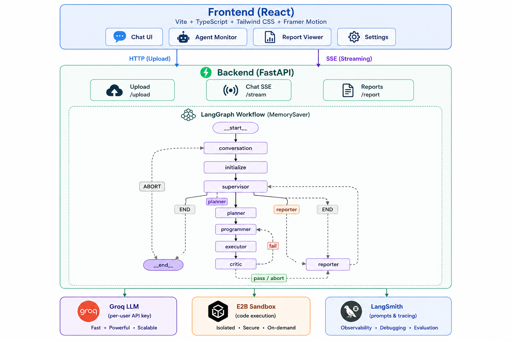
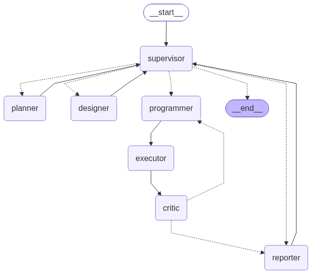

# DataScribe

**Multi-Agent AI Data Analysis Platform**

DataScribe is an autonomous, multi-agent data science assistant. Upload a dataset (CSV/Excel/Parquet), ask a question in plain English, and watch a team of specialized AI agents plan, generate code, execute it in a secure sandbox, critique the results, and produce a polished report with interactive charts — all streamed live to your browser.

---

## ✨ Highlights

- **6-agent LangGraph workflow** — Conversation agent → Initialize → Supervisor agent → Planner agent → Programmer agent → Executor → Critic agent → Reporter agent
- **Live SSE streaming** — Every agent step, code snippet, execution output, and report token streams in real time
- **Secure code execution** — Generated Python runs inside an isolated [E2B](https://e2b.dev) sandbox with AST-based guardrails
- **Interactive visualizations** — Plotly HTML charts and static PNG charts rendered inline with fullscreen & download support
- **Self-correcting loop** — The Critic agent reviews results and can request the Programmer to retry with feedback
- **Report export** — Download reports as PDF or self-contained interactive HTML
- **LangSmith integration** — Prompt management, tracing, and a full evaluation framework
- **Dark / light theme** with a gold-accented design system

---

## 🏗️ Architecture



### Agent Descriptions

| Agent | Role |
|---|---|
| **Conversation Agent** | Classifies the user query — routes to the full analysis workflow, answers directly, or rejects |
| **Initialize Node** | Loads the uploaded dataset, extracts schema (dtypes, null counts, memory usage) |
| **Supervisor Agent** | Decides the next high-level action: plan more analysis, generate a report, or end |
| **Planner Agent** | Breaks the request into analysis, visualization, and statistical tasks with an execution order |
| **Programmer Agent** | Generates Python code (pandas, matplotlib, seaborn, plotly) to fulfill the plan |
| **Executor Node** | Runs the code in an E2B sandbox, collects charts and output, downloads artifacts |
| **Critic Agent** | Reviews execution results — passes, fails (triggers retry), or aborts |
| **Reporter Agent** | Assembles the final markdown report with embedded charts and memory updates |

---

## LangGraph Workflow


## 🚀 Quick Start

### Prerequisites

- **Python 3.12**
- **Node.js 20+**
- A **Groq API key** ([groq.com](https://console.groq.com))
- An **E2B API key** ([e2b.dev](https://e2b.dev)) for sandbox code execution
- A **LangSmith API key** ([smith.langchain.com](https://smith.langchain.com)) for prompt management, observability and Evaluation

### 1. Clone & Install

```bash
git clone https://github.com/Noore-hira/DataScribe.git
cd DataScribe
```

### 2. Backend

```bash
# Install Python dependencies
pip install -r requirements.txt

# Configure environment
cp .env
# Edit .env with your Groq, E2B, and LangSmith API keys

# Run the API server
uvicorn Backend.main:app --reload --port 8000
```

The API will be available at `http://localhost:8000` with auto-generated docs at `/docs`.

### 3. Frontend

```bash
cd frontend
npm install
npm run dev
```

Open `http://localhost:5173` in your browser.

### 4. Docker (Alternative)

```bash
docker build -t datascribe .
docker run -p 8000:8000 --env-file .env datascribe
```

### 5. CI/CD Pipeline

DataScribe includes a GitHub Actions workflow (`.github/workflows/deploy.yml`) that automatically builds and deploys the Docker image on every push to `main`:

| Step | Description |
|---|---|
| **Trigger** | Runs on push to the `main` branch |
| **Build** | Builds the Docker image from the `Dockerfile` |
| **Push** | Pushes the image to **AWS ECR** (`us-east-1` region, repository: `datascribe-backend`) |
| **Secrets** | Requires `AWS_ACCESS_KEY_ID` and `AWS_SECRET_ACCESS_KEY` configured in GitHub repository secrets |

To set up the CI/CD pipeline, add the following secrets to your GitHub repository:

1. Go to **Settings → Secrets and variables → Actions**
2. Add `AWS_ACCESS_KEY_ID` and `AWS_SECRET_ACCESS_KEY` with permissions to push to ECR

---

## 📖 Usage

1. **Enter your Groq API key** in the Settings panel (stored locally in your browser only).
2. **Upload a dataset** — drag & drop or click the attachment button. Supports CSV, Excel, and Parquet (max 25 MB).
3. **Ask a question** in plain English, e.g.:
   - *"What's the average salary by department?"*
   - *"Create a bar chart of sales by region and a correlation heatmap."*
   - *"Run a t-test on the two groups and summarize the findings."*
4. **Watch the agents work** in real time via the Agent Monitor panel — see code generation, execution output, and chart previews as they happen.
5. **Review the report** in the Reports tab. Export as PDF or interactive HTML.

---

## 🔌 API Reference

| Method | Endpoint | Description |
|---|---|---|
| `GET` | `/api/health` | Health check |
| `POST` | `/api/upload` | Upload a dataset (multipart form, max 25 MB) |
| `GET` | `/api/chat/stream` | SSE stream for agent workflow execution |
| `GET` | `/api/report/{filename}` | Download a generated report file |
| `DELETE` | `/api/session/{thread_id}` | Clear all files for a session |
| `GET` | `/storage/{path}` | Serve uploaded files |
| `GET` | `/charts/{path}` | Serve generated chart artifacts |

## 🧪 Evaluation

DataScribe includes a comprehensive **LangSmith-based evaluation framework** that assesses both individual agents and the complete end-to-end workflow. Each evaluation uses an LLM judge (Groq `llama-3.3-70b-versatile`) to score outputs on a **1–5 scale** across multiple metrics, rewarding semantic equivalence rather than exact textual matches.

### Evaluation Scripts

| Script | Agent(s) Evaluated | Dataset | Metrics |
|---|---|---|---|
| `evaluate_conversation.py` | Conversation router | `conversation_test.csv` (120 cases) | Route correctness (exact match) |
| `evaluate_planner.py` | Planner | `planner_dataset.csv` (7 cases) | Correctness, Completeness, Relevance |
| `evaluate_programmer.py` | Programmer | `programmer_dataset.csv` (7 cases) | Correctness, Executability |
| `evaluate_workflow.py` | Full 8-agent workflow | `workflow_dataset.csv` (5 cases) | Routing, Planning, Execution, Reporting, Overall |

```bash
# Evaluate the conversation router (120 test cases)
python evaluation/evaluate_conversation.py

# Evaluate the planner (7 test cases)
python evaluation/evaluate_planner.py

# Evaluate the programmer (7 test cases)
python evaluation/evaluate_programmer.py

# Evaluate the complete end-to-end workflow (5 test cases)
python evaluation/evaluate_workflow.py
```

### How It Works

1. **Datasets** — Each evaluator pulls test cases from a LangSmith dataset. Datasets are also mirrored as CSV files in `evaluation/datasets/` for local inspection and manual upload.
2. **Target function** — Each script defines a target function that invokes the corresponding agent node (or the full LangGraph `app`) with the dataset inputs, returning the agent's output.
3. **LLM judge** — A Groq LLM judge, configured with a structured output schema, scores each result against the expected reference on a 1–5 scale. Judges are designed to reward semantically equivalent solutions and ignore wording, formatting, and variable-name differences.
4. **Results** — LangSmith records per-example scores, comments, and aggregate metrics in the `DataScribe` project, viewable in the LangSmith UI.

### Evaluation Datasets

| Dataset | File | Test Cases | Description |
|---|---|---|---|
| Conversation Agent Evaluation | `conversation_test.csv` | 120 | Routes user queries to `answer`, `initialize`, or `reject` across 10 categories (Greeting, Politeness, Identity, Capability, Memory, Analysis, Statistics, Visualization, Advanced, Off-topic) |
| Planner Evaluation | `planner_dataset.csv` | 7 | Plans for insights, filtering, classification metrics, latency, EDA, correlation heatmaps, and sales analysis |
| Programmer Evaluation | `programmer_dataset.csv` | 7 | Reference Python code for the same 7 planning tasks |
| Workflow Evaluation | `workflow_dataset.csv` | 5 | End-to-end workflow runs with expected routes, plan keywords, execution status, chart counts/types, report keywords, critic verdicts, and retry counts |

### Custom Evaluators

Custom evaluators live in `evaluation/evaluators/` and define the scoring logic for each agent:

| Evaluator | File | Metrics |
|---|---|---|
| `route_evaluator` | `conversation_evaluators.py` | Exact-match route correctness |
| `evaluate_plan_metrics` | `planner_evaluators.py` | Correctness, Completeness, Relevance (1–5) |
| `evaluate_code_metrics` | `programmer_evaluators.py` | Correctness, Executability (1–5) |
| `evaluate_workflow_metrics` | `workflow_evaluators.py` | Routing, Planning, Execution, Reporting, Overall (1–5) |

### Prerequisites

- A **LangSmith API key** — set `LANGSMITH_API_KEY` in `evaluation/.env`
- A **Groq API key** — set `GROQ_API_KEY` in `evaluation/.env` (used by the LLM judges)
- Datasets must be uploaded to LangSmith (or created from the CSV files) with the names referenced in each script (e.g., `Conversation Agent Evaluation`, `Planner Evaluation`, `Programmer Evaluation`, `Workflow Evaluation`)

---

## 📁 Project Structure

```
DataScribe/
├── Backend/
│   ├── main.py                          # FastAPI app entry point
│   ├── app/
│      ├── api/                         # REST + SSE endpoints
│      │   ├── chat.py                  # SSE streaming endpoint
│      │   ├── upload.py                # Dataset upload
│      │   ├── health.py                # Health check
│      │   ├── report.py                # Report download
│      │   └── session.py               # Session cleanup
│      ├── services/
│      │   ├── graph_service.py         # LangGraph execution runner
│      │   └── stream_service.py        # SSE event processing & heartbeat
│      └── src/
│          ├── config.py                # LLM factory (Groq, per-user key)
│          ├── data_frame.py            # Dataset loading (CSV/Excel/Parquet)
│          ├── agents/                  # 8 LangGraph agent nodes
│          │   ├── conversation_node.py
│          │   ├── initialize_node.py
│          │   ├── supervisor_node.py
│          │   ├── planner_node.py
│          │   ├── programmer_node.py
│          │   ├── executor_node.py
│          │   ├── critic_node.py
│          │   └── reporter_node.py
│          ├── graph/
│          │   ├── graph_workflow.py    # Workflow definition & routing
│          │   ├── state.py             # TypedDict state schema
│          │   └── state_utils.py       # State accessors
│          ├── memory/
│          │   └── memory_manager.py    # Session summary & compression
│          ├── utils/
│          │   ├── code_executor.py     # Code extraction & execution
│          │   └── safe_execution.py    # AST-based code guardrails
│          └── logs/
│              └── logger.py            # Structured logging
│ 
├── frontend/
│   ├── src/
│   │   ├── App.tsx                      # Root component (routes, providers)
│   │   ├── main.tsx                     # React entry point
│   │   ├── pages/                       # ChatPage, ReportsPage, SettingsPage
│   │   ├── components/
│   │   │   ├── layout/                  # Sidebar, Header, RightPanel
│   │   │   ├── chat/                    # ChatMessage, ChatInput
│   │   │   ├── upload/                  # UploadCard
│   │   │   ├── workflow/                # WorkflowEvents, AgentMonitor
│   │   │   ├── report/                  # ReportViewer
│   │   │   ├── agents/                  # AgentCard, AgentMonitor
│   │   │   ├── settings/                # ApiKeyInput, ModelSelector, ThemeToggle
│   │   │   └── common/                  # Logo, AnimatedBackground, StatusBadge
│   │   ├── contexts/                    # Settings, Session, Workflow contexts
│   │   ├── services/                    # api.ts, sse.ts
│   │   ├── hooks/                       # use-toast, use-connection-status
│   │   ├── types/                       # TypeScript type definitions
│   │   └── lib/                         # Utility functions
│   └── public/
├── evaluation/                          # LangSmith evaluation framework
│   ├── evaluate_conversation.py         # Conversation router evaluation
│   ├── evaluate_planner.py              # Planner evaluation
│   ├── evaluate_programmer.py           # Programmer evaluation
│   ├── evaluate_workflow.py             # End-to-end workflow evaluation
│   ├── evaluators/                      # Custom LangSmith evaluators
│   │   ├── conversation_evaluators.py
│   │   ├── planner_evaluators.py
│   │   ├── programmer_evaluators.py
│   │   └── workflow_evaluators.py
│   └── datasets/                        # Evaluation test-case CSVs
│       ├── conversation_test.csv
│       ├── planner_dataset.csv
│       ├── programmer_dataset.csv
│       └── workflow_dataset.csv
├── Dockerfile
├── langgraph.json
├── pyproject.toml
├── requirements.txt
├── .env
└── workflow_diagram.png
```

---

## ⚙️ Configuration

### Environment Variables (`.env`)

| Variable | Description |
|---|---|
| `GROQ_API_KEY` | Groq API key (also provided per-request from the frontend) |
| `E2B_API_KEY` | E2B sandbox API key for code execution |
| `LANGSMITH_API_KEY` | LangSmith API key for prompt management & tracing |
| `LANGSMITH_PROJECT` | LangSmith project name (default: `DataScribe`) |
| `LANGSMITH_TRACING_V2` | Enable LangSmith V2 tracing (true to enable) |

### Supported LLM Models

- `llama-3.3-70b-versatile` (default)
- `llama-3.1-8b-instant`
- `openai/gpt-oss-120b`

---

## 🛡️ Security

- **Per-user API keys** — The Groq API key is provided by the user at request time; no server-side key storage.
- **E2B sandbox** — All generated Python code executes in an isolated, ephemeral sandbox.
- **AST guardrails** — Generated code is validated before execution: dangerous builtins, filesystem APIs, and network calls are blocked.
- **CSP headers** — Strict Content-Security-Policy on API routes; relaxed CSP only for interactive chart iframes.
- **File upload limits** — 25 MB max, restricted to CSV/Excel/Parquet.

---

## 📜 License

Apache License 2.0 — see [LICENSE](LICENSE).

---

## 🙏 Acknowledgements

- **[LangGraph](https://langchain.com/langgraph)** — Multi-agent workflow orchestration
- **[LangChain](https://langchain.com)** — LLM abstractions and prompt management
- **[Groq](https://groq.com)** — Fast LLM inference
- **[E2B](https://e2b.dev)** — Secure cloud sandboxes for code execution
- **[LangSmith](https://smith.langchain.com)** — Prompt management, tracing, and evaluation
- **[Plotly](https://plotly.com)** & **[Seaborn](https://seaborn.pydata.org)** — Data visualization
- **[FastAPI](https://fastapi.tiangolo.com)** — Backend web framework
- **[React](https://react.dev)** + **[Vite](https://vitejs.dev)** + **[Tailwind CSS](https://tailwindcss.com)** — Frontend stack
